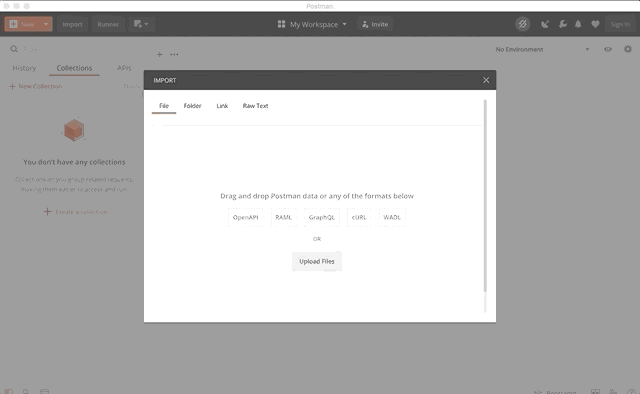
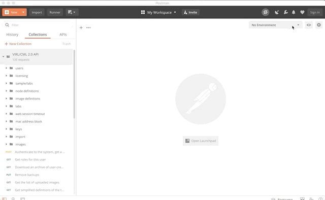
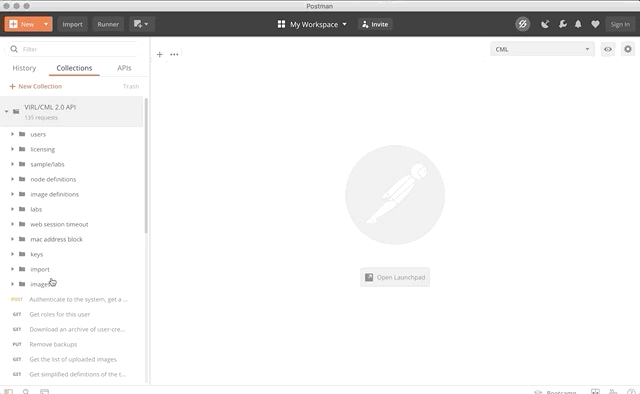

# Getting started with Cisco Modelling Labs

Cisco Modeling Labs is a tool for building virtual network simulations (or labs) for you to test out new topologies, protocols, and config changes; automate network tests via CI/CD pipeline integration; and a safe place for you to try out new things. Cisco Modelling Labs 2 the latest version has been rebuilt from the ground up, with an all new HTML5 user interface and smaller footprint allowing for much greater performance in simulations.

In the Network simulation is becoming an increasingly important area, particuarly with organisations looking to adopt network automation, we often need safe environments where we can test and understand our automation tooling is working correctly so that when we deploy to production networks we know what we're expecting to happen.

One of the key usecases of CML-2 is for integrating in CICD pipelines. A big advantage of CML-2 over other simulation systems is the new REST API which allows us to automate the creation and running of simulations. After doing an intitial introduction of CML we'll explore the API and understand how it can be leveraged. In this guide we're going to get the user set up with CML for the first time then examine the API under the hood of CML and look at how we could potentially leverage it for some interesting usecases.

## Sandbox environment / Prerequsites 

To follow this lab you will need an instance of CML2. For this you have 2 options the first to build your own environment or to use the prebuilt DevNet sandbox.

If you are looking to build your own CML environment you'll first need to purchase licenses for  limited to 20 nodes Can be purchased for $199. If you are interested in purchasing CML Personal you can do so from this [link](https://learningnetworkstore.cisco.com/cisco-modeling-labs-personal/cisco-cml-personal) 


There is also a Enterprise edition which allows a higher node count and more flexibility, for more information on this reach out to your Cisco account team or a Cisco partner. What you will read on this guide is working with personal however the underlying system between Personal and Enterprise is similar therefore things like the API and functionality we discuss is applicable. 

Alternatively and what I'd recommend doing if you're just starting out and just want to get to grips with CML  is to use the excellent DevNet sandbox where you can reserve an instance of CML2 for up to 4 hours. This sandbox provides access to a Cisco Modeling Labs system that can be used to explore the capabilities of the newest release of Cisco Modeling Labs. This is quite a generous system with almost 40GB of RAM and 57GB of disk space so theres space to do some pretty decent simulations. All DevNet sandboxes are completely free and can be accessed within seconds.

https://developer.cisco.com/docs/sandbox/#!overview/all-networking-sandboxes 

To complete the API section of this lab youwill also need API testing tool postman. To download that please visit Postmans website [here](https://www.postman.com) and install the app for your platform

## The Basics

If you're using the sandbox when you first login there's already a premade simulation you can try out. I'm going to stop and delete this for now and walk you through the process of creating you're own simulation but feel free to explore the simulation to get to grips .

Cisco Modeling Labs supports many platforms – Today Cisco Modeling Labs supports the following nodes:
IOSv and IOSvL2
NX-OSv and NX-OS 9000v
IOS XRv and IOS XRv 9000
IOS XE (CSR1000v)
ASAv
Supporting systems including Linux boxes, WAN emulators and Traffic simulations and more 

### Creating a topoloy

First thing we need to do is create a topology, in this we're going to keep it simple and build a topology with 2x CSR1000v devices and connect them together through a WAN emulation box. To do this click on the +Add Lab button on the top right and create a lab, then select you're newly created lab from the simulations pane

When you enter into the lab, you'll be greeted with your canvas. Drag your devices you want onto the canvas, in the case below i've selected 2 CSR1000v devices and a WAN emulation device. To create links over the devices hover your cursor over the node you wish to connect from and select the blue link icon, hold your mouse down and drag it to the device you want to connect to. A small dialogue box should appear and allow you to select the exact port. Cable your devices as we have in the graphic below.


To power on the devices hover your cursor over the devices and select the green power on option, give the devices a couple of minutes to allow CML to boot them up. 


You can feel free to make some config to the devices if you'd like by going into the console and configuring the devices. Feel free to explore the simulation options and add some other nodes in too. Otherwise congratulations you've just built your first simulation.

Tip: A really nice simple feature is the WAN emulation node that I've included in our simulation. This acts as a purely layer 2 node can be configured to simulate a variety of transport methods really easily. To configure the WAN emulation go to the console of the device and enter option 1, select profile to see what options you have. Alternatively you can tweak the bandwidth, loss, jitter and latency yourself.


### Importing a topology

You also have the option of exporting/importing a topologies into CML. To export when you're in the CML workbench for a lab this can simply be done by selecting the 3 horizontal lines drop down and selecting "download lab" you will then be prompted to download your lab.


To import, thats even easier from the main CML screen select the "Import Lab" button on the top right and then provide CML with the YAML file lab descriptor. CML will then do the rest and direct you to your newly imported topology. It's that easy!


Try this with your own topology, download it, delete it then important again. Although feel free to import a topology from the folder in this repo called "topologies" where we have a few options in there.

## CML Automation

By now you should be comfortable with the basics of topologies, how you create them, change and delete them. In this next section what we're now going to do is examine the REST API for CML with a couple of example usecases.

### The API

One of the real advantages of this version of CML is the excellent API which allows us to automate many of the common tasks when using CML. As mentioned previously this could allow for integration into a CICD pipeline. 

Tasks we could automate include:

* Spin up and down simulations
* Edit simulations while running (add extra link, add node etc)
* Get detailed information from devices on a simulation
* Conduct actions such as a packet capture

#### Swagger documentation

If you're using the sandbox the API documentation can be found at https://10.10.20.161/api/v0/ui/ 

The documentation goes into a lot of detail on the endpoints available to you and also provides an environment where you can try the endpoints out. For example in the animations below where we get an authentication token then use that to get a list of the available sample labs. For some users this will get you up and running and you'll be able to experiment with the API... If you're looking to understand a bit more read on...


#### Postman

To get to grips with the API we're going to use API testing tool Postman to try out a few common tasks that the API is capable of

In the postman folder of this repo we have included a Postman collection which can be imported into your postman environmeent by using the 'import' button on the top left of the screen. This includes 135 different endpoints for using the CML API and is a quick way for us to understand the API's capabilities.



We need to set an environment variable of baseUrl so our calls go to the right place. If you are using the sandbox this will be 'https://10.10.20.161/api/v0'. If you're using your own instance, change the IP address to suit your deployment. To set the environment variables, select the 'eye' icon and create a new environment, call it CML and create just one variable called baseUrl with the value above. (case sensitive). 



Make sure you have the CML environment selected like the animation above. Now we're ready to get your auth token as we did with the swagger documentation. To do that select the endpoint on the left hand side called "Authenticate to the system, get a web token" Select the body and ensure our username and password is going to be sent in the request, in our case for the sandbox developer/C1sco12345. Once you do that examine the response and see the web token thats returned.



#### Create a Lab

Now we've authenticated and have our authorisation token, take a copy of that from the body response. We'll need it in a minute, now it's time to try out another API endpoint. Let's try create a new lab simulation, under the endpoint folder "labs" select the "Create new lab" endpoint.

From there to the authorisation tab and select type "bearer token" and paste in the response from the last step, your authentication token. Edit the title in the call also to give your new lab simulation a name, press send and examine the response. You should get a response like below to tell you it's been sucessful. Examine your CML dashboard too to verify

```
{
  "state": "DEFINED_ON_CORE",
  "created": "2020-05-12 22:15:41",
  "lab_title": "testLab",
  "lab_description": "",
  "node_count": 0,
  "link_count": 0,
  "id": "bdccbe"
}
```


#### Import a topology
 
Realistically, when you're just getting started you're probably not going to create a topology with the API then add each individual device and config. You're likely to have a test network you'll set up once and want to use multiple times, for that usecase we're going to examine how to import an existing topology and start the simulation using only the API

Take the yaml output below and copy it into the body of the request. This can also be found in the CML-topologies folder of this repo. This will instruct CML exactly how our lab should look like and how devices should be configured.

Again don't forget to copy across your authentication token too into the authentication tab.

You'll also want to edit the endpoint given so that you give your simulation you're about to create a name. Edit the URL endpoint with the name you wish to give your simulation.


 
 ```
 lab:
  description: ''
  notes: ''
  timestamp: 1589315403.782141
  title: Lab at Tue 20:30 PM
  version: 0.0.3
nodes:
  - id: n0
    label: csr1000v-0
    node_definition: csr1000v
    x: -600
    y: -50
    configuration: hostname inserthostname_here
    image_definition: csr1000v-161101b
    tags: []
    interfaces:
      - id: i0
        label: Loopback0
        type: loopback
      - id: i1
        slot: 0
        label: GigabitEthernet1
        type: physical
      - id: i2
        slot: 1
        label: GigabitEthernet2
        type: physical
      - id: i3
        slot: 2
        label: GigabitEthernet3
        type: physical
      - id: i4
        slot: 3
        label: GigabitEthernet4
        type: physical
  - id: n1
    label: csr1000v-1
    node_definition: csr1000v
    x: 0
    y: -50
    configuration: hostname inserthostname_here
    image_definition: csr1000v-161101b
    tags: []
    interfaces:
      - id: i0
        label: Loopback0
        type: loopback
      - id: i1
        slot: 0
        label: GigabitEthernet1
        type: physical
      - id: i2
        slot: 1
        label: GigabitEthernet2
        type: physical
      - id: i3
        slot: 2
        label: GigabitEthernet3
        type: physical
      - id: i4
        slot: 3
        label: GigabitEthernet4
        type: physical
  - id: n2
    label: wan-em-0
    node_definition: wan_emulator
    x: -300
    y: -100
    configuration: |-
      LATENCY="500"
      JITTER="5"
      LOSS="30.0"
      BANDWIDTH="512"
    image_definition: alpine-3-10-wanem
    tags: []
    interfaces:
      - id: i0
        slot: 0
        label: eth0
        type: physical
      - id: i1
        slot: 1
        label: eth1
        type: physical
links:
  - id: l0
    i1: i1
    n1: n0
    i2: i0
    n2: n2
  - id: l1
    i1: i1
    n1: n2
    i2: i1
    n2: n1
```

Go back and check your simulations, you should see the above simulation has been added. Now to start that simply take the lab ID response and


Congratulations, you've used the API to create and start your own topologies.

#### Convert to code

One of the really nice features of Postman is the ability to convert your REST API call into code which you can use in a programming language of your choice. To do this select the code option on the API call you want to convert and select your langauge you want the code in. Postman will provide you with an example you can use, this is really nice if you're just getting started! With this you might now have enough to get building your own scripts.


### Python SDK

Alternatively, 
